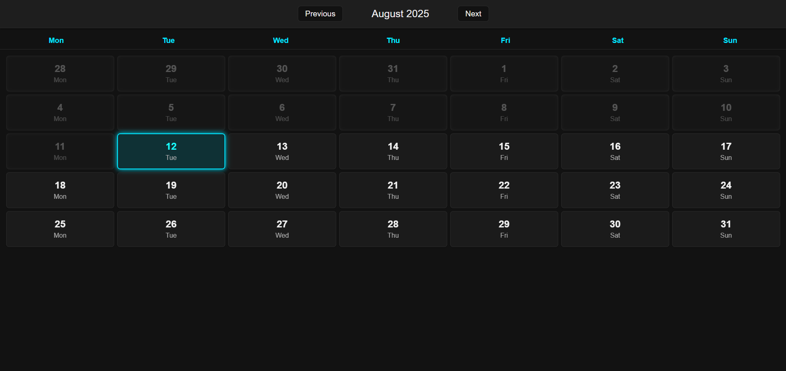

# 📅 Angular Calendar App

A clean, modern, and responsive **calendar application** built using **Angular 19**, **SCSS**, and a **service-driven architecture**.  
Includes **month navigation**, **current day highlighting**, **past/upcoming day styling**, and **outside-month day dimming** — all wrapped in a **beautiful, consistent UI**.

---
## 🌐 Live Demo

👉 [Click here to try the app](https://ahmad-889.github.io/calendar/)

---

## 🎯 What I Built


This application is designed with **standalone components** for scalability and maintainability.  
Here’s what’s inside:

* ✅ `CalendarPageComponent`: Renders the full calendar view with navigation  
* ✅ `DayCardComponent`: Displays individual day cards with styling for today, past, upcoming, and outside-month days  
* ✅ `CalendarService`: Handles date calculations, month transitions, and helper functions  
* ✅ Fully responsive layout with SCSS and custom themes

---

## 💡 Key Features

* 📆 **Full month view** with Monday as the starting day  
* ⏪ **Previous / Next month navigation** with smooth updates  
* 📍 **Today highlighting** with special border and background  
* 🕒 **Past day dimming** (non-clickable, grayed out)  
* 🌟 **Upcoming days styling** with hover effects  
* 🌓 **Days outside the current month dimmed** for clarity  
* 📱 Fully responsive for desktop and mobile screens

---

## 🧱 Technologies Used

* Angular 19 (Standalone Components)
* TypeScript
* SCSS (Custom, consistent styling + Responsive Design)
* Date handling with native JavaScript Date API


---

## 📸 Screenshot



---

## 📁 Project Structure

```
src/
└── app/
├── components/
│ ├── calendar-page/
│ │ ├── calendar-page.component.ts   # Main calendar view
│ │ ├── calendar-page.component.html # Calendar layout
│ │ └── calendar-page.component.scss # Calendar styling
│ └── day-card/
│ ├── day-card.component.ts          # Individual day logic
│ ├── day-card.component.html        # Day UI template
│ └── day-card.component.scss        # Day styling
├── services/
│ └── calendar.service.ts            # Date calculations & helpers
```
## 🚀 Running the Project

Install Angular CLI if you haven't:

```bash
npm install -g @angular/cli
```

Install dependencies and serve:

```bash
npm install
ng serve
```

Visit `http://localhost:4200` to see the custom directives in action.

---

## 🔗 Author
Made with ❤️ by
Muhammad Ahmad
